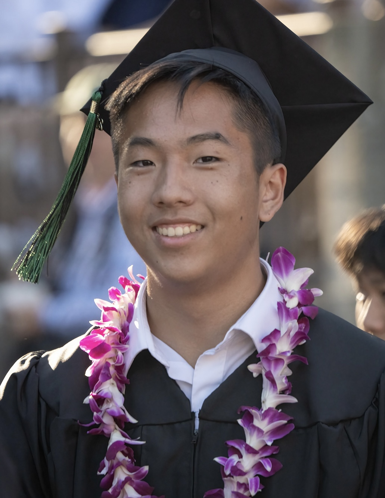

# About Me

Hi, I am **Anthony Tong**.

I am a third year undergraduate student double majoring in Computer Science and Applied Mathematics
at University of California, San Diego (UCSD) and broadly interested in building tools for
applications in AI.

I am currently working with Professor [Gary Cottrell](https://cseweb.ucsd.edu/~gary/) on the SMART (Small Molecule Accurate Recognition Technology) project. I was previously advised by Professor
[Edwin Solares](https://edwinsolares.com/) on multiple computer vision projects regarding species
rescue and agricultural and language conservation, as well as Professors [Shengjie (Patrick) Zhai](https://www.unlv.edu/people/shengjie-zhai) and [Ming Zhu](https://www.unlv.edu/people/ming-zhu-phd)
on an analytical project on LLM tokenization and domain adaptation. I am also grateful to have
previously worked with Professor [Arya Mazumdar](https://mazumdar.ucsd.edu/) as part of the Regents
Scholars Research Initiative (RSRI) on some topics exploring logistic regression and diffusion
generative models.

---

## News and Updates

- I will be a head tutor for *CSE 150A: Introduction to Artificial Intelligence* in Summer Session I 2025!
- I will be a head tutor for *CSE 151B: Deep Learning* in Spring 2025!
- I will be a head tutor for *CSE 150A: Introduction to Artificial Intelligence* in Winter 2025!

 

